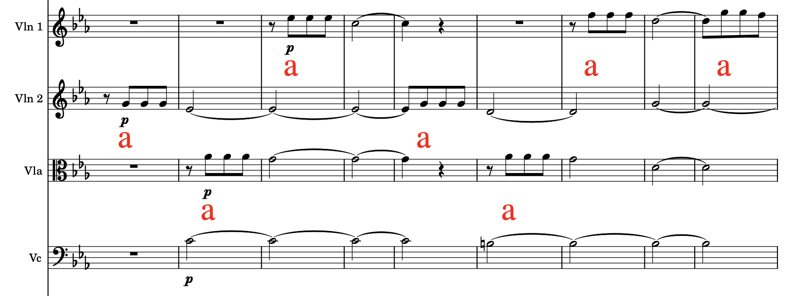

# "Hauptstimme" and the "OpenScore Orchestra"

This repository contains two interconnected datasets along with code for processing that data.


## OpenScore Orchestra

The OpenScore Orchestra Corpus consists of c.100 transcribed orchestral movements:

| Composer               | Large scale work(s)                 | Movements  |
|------------------------|-------------------------------------|------------|
| Bach, Johann Sebastian | B Minor Mass, BWV.232               | 27         |
| Bach, Johann Sebastian | Brandenburg Concerto No.3, BWV.1048 | 3          |
| Bach, Johann Sebastian | Brandenburg Concerto No.4, BWV.1049 | 3          |
| Beach, Amy             | Symphony in E minor (Gaelic), Op.32 | 4          |
| Beethoven, Ludwig van  | Complete Symphonies (1–9)           | 37         |
| Boulanger, Lili        | _D'un matin de printemps_           | 1          |
| Brahms, Johannes       | _Ein Deutsches Requiem_, Op.45      | 1 (from 7) |
| Brahms, Johannes       | Complete Symphonies (1–4)           | 16         |
| Bruckner, Anton        | Symphony No.5, WAB.105              | 4/5        |

Movement numbering is complex in the following cases:
- Bach: B Minor Mass. The movements are numbered according to NBAII (1–23) and are split by movement where possible (e.g., 7a from 7b), but not in the case of dovetail (e.g., 4a and 4b are one with double bar line and editorial tempo marking).
- Bruckner: Symphony No.5, WAB.105. We split the 3rd movement into two files.

We explain the [stylistic design criteria for the scores here](docs/score_design.md).


## Hauptstimme

When listening to music, our attention is drawn back and forth between different elements.
Often this is guided by following the main, most prominent melodic line: the _Hauptstimme_.

The Hauptstimme annotations provide human analysis annotations for where they think the "main theme" is in each of the above works. 
Please see [this explanation](docs/annotation.md)
for more details on the annotation method and FAQs.

Here is an example of what the annotated scores look like.
This is a famous melody (the start of the main theme in Beethoven's 5th)
that's distributed among several parts.




## Data Summary

The datasets include the following files for each orchestral work in the format `<identifier>` plus:
- `.mscz`: The annotated MuseScore file.
- `.mxl`: A conversion of the `.mscz` file.
- `.mm.json`: The compressed ['measure map'](https://dl.acm.org/doi/10.1145/3625135.3625136) – a lightweight representation of the bar information to enable alignment with other corpora.
- `.csv`: A 'lightweight' .csv file extracted from the full score (with repeats expanded), indicating the highest pitch being played by each instrument part at every timestamp in which a change occurs in the score.
- COMING SOON...
`_alignment.csv`: An alignment table containing timestamps for each score note onset in a set of public domain / open licence audio recordings obtained from the International Music Score Library Project [(IMSLP)](https://imslp.org). (These files are only included for scores with sufficiently high-quality alignments.)
- `_annotations.csv`: Information about each annotation including the qstamp, theme label, and instrument.
- `_melody.mxl`: The annotated melody segments stitched together to form a single-stave 'melody score'.
- `_part_relations.csv`: A derived analysis of the interplay between the score parts in each Hauptstimme annotation block.

The filename structure is as follows:
```
data/<composer>/<set>/<score>/<files>
```
- `<composer>` is the composer's name in the form `<Last,_First_Second>`.
- `<set>` is an identifier for the work.
- `<score>` is the movement number for multi-movement works. For single-movement works, the \verb`<score>` level is omitted.


## Code Summary

We provide the following scripts, located in `scripts/`:
- `main.py`: Take a score's MuseScore file and produce the rest of the files specified above (except the alignment table).
- `build_corpus.py`: Produce all corpus files from each score's MuseScore file.
- `get_part_relations.py`: Take a score's MusicXML file and produce a part relationships summary.
- `compare_segmentations.py`: Take a score's MusicXML file and perform a comparison of the Hauptstimme annotation points to three different sets of automatic segmentation points (novelty-based (tempogram features), novelty-based (chromagram features), and changepoint detection-based).
- `align_score_audios.py`: Take a score's MuseScore/MusicXML file and a set of audio files, then align the audio files to the score, producing an alignment table.

See each script's docstring for how it can be run in the command line.

We also provide Jupyter notebooks, located in `notebooks/`:
- `demo.ipynb`: A demonstration of how the functions in `src` can be used directly.
<!-- - `proofs_of_concept.ipynb`: Code showcasing how the comparison of Hauptstimme annotations and video annotations for two proofs of concept (as seen in the paper) was conducted. -->

<!-- Possible future TODOs:
- Renumbering scores based on measure maps.
- Analysis of hypotheses such as 'loud dynamic and lots of unison = camera on whole orchestra'.
- Distance between melodic blocks and clustering.
- Extracting all instances of a particular theme.
- Allowing multiple annotations at the same timestamp (currently causes issues with the part relationship summaries, but would be useful in the case of polyphony).
- Produce instrument range data and other data summaries.
(see `range_data_adler_chon_huron_devlieger.csv`) -->

Development was done in Python 3.11. 


## Requirements

Please run `pip install -r requirements.txt --no-deps` to install the Python dependencies. 

`--no-deps` is required due to a clash in the dependencies: `synctoolbox` and `libfmp` require `music21<6.0.0,>=5.7.0`, but `pyMeasureMap` requires a much newer version. However, having `music21 9.1.0` caused no issues with the functionality used from `synctoolbox` and `libfmp`.

Additional dependencies include:
- MuseScore 4
- If you want to align your own scores and audio files: the `libsndfile` C library (required by the `soundfile` Python package). After installing it you may need to run:
```bash
  pip uninstall soundfile
  pip install soundfile
```


## Acknowledgements

Many thanks to:
- Deutsche Telekom for funding part of this work in the context of the 'Beethoven X' project.
- Fellow 'Beethoven X' project team members for discussions.
- Annotators:
  - On the 'Beethoven X' project, including Nicolai Böhlefeld and many others.
  - At Cornell, Eastman, TU Dortmund, Durham, and elsewhere.
- Transcribers, both:
  - in our immediate team, and 
  - more widely across the MuseScore community, members who made transcriptions freely available under the CCO licence and named their source edition.

  
## Licence 

- Scores: CC0 1.0 Universal
- Annotations: CC-By-SA
- Code: MIT

All scores have been copied from clearly identified and unequivocally public source editions on IMSLP.
Transcribers have committed to making these transcriptions using that public source edition, and working from scratch.
We have confidence in our team and their work but obviously cannot make any guarantees.
If you see anything that we ought to review, please let us know.


## Citation

To follow.
